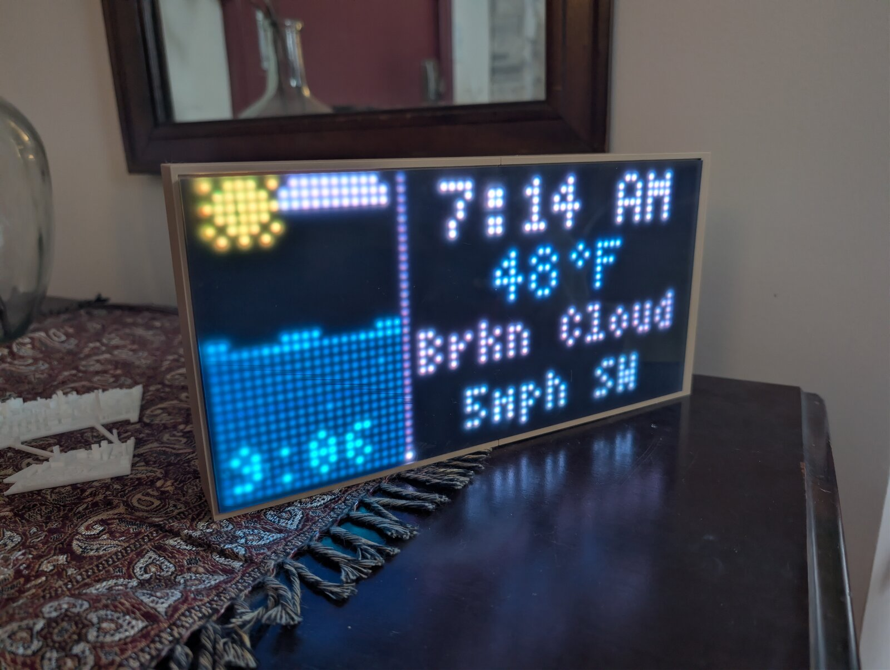
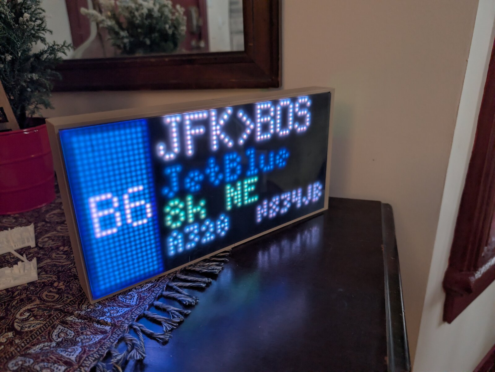
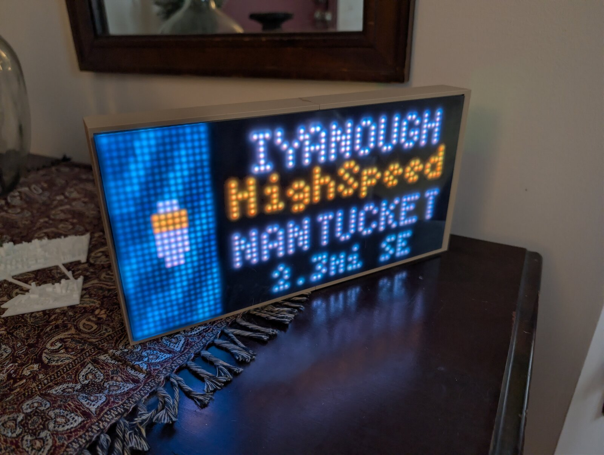

# Matrix Portal Tracker



A live weather, tide, aircraft, and ship tracker that runs on an Adafruit MatrixPortal driving a 64×32 RGB LED matrix.

The display cycles between three screens depending on what's happening nearby:

**Weather + Tides** (default)
- Animated tide basin with pixel-art weather sky (sun/moon/clouds/rain/snow/lightning/fog)
- Current temperature, conditions, and wind
- Next high or low tide time
- Live clock

**Aircraft** (when planes are overhead)



- Airline color scheme, IATA code, flight route (e.g. `BOS→SFO`)
- Airline name, altitude, compass heading
- Aircraft type code and tail number

**Ships** (when vessels are nearby)



- Vessel name, type, and destination (when available)
- Distance and heading
- Animated ship silhouette on an ocean background, scaled by vessel length

Tides and ships are most useful in coastal areas — tide predictions come from NOAA stations (mostly US coastlines, Great Lakes, and US territories) and ship positions come from terrestrial AIS receivers (mostly within ~40 mi of populated coasts).

---

## Hardware

| Part | Link |
|------|------|
| Adafruit MatrixPortal S3 | https://www.adafruit.com/product/5778 |
| Adafruit MatrixPortal M4 (older, also works) | https://www.adafruit.com/product/4745 |
| 64×32 RGB LED Matrix (3 mm pitch) | https://www.adafruit.com/product/2278 |
| 5 V / 2 A+ USB-C power supply | any |

You also need an always-on Linux box on the same network to run the proxy — a Raspberry Pi Zero W is plenty.

### 3D-printed case

A printable enclosure for the MatrixPortal + 64×32 panel is included in [`stl/weather_display_case.stl`](stl/weather_display_case.stl). Print it on any FDM printer — a 0.4 mm nozzle and 0.2 mm layer height work fine. No supports needed.

---

## Architecture

```
[MatrixPortal device]  ── Wi-Fi ──►  OpenWeatherMap  (weather, every 10 min)
                                 ──►  NOAA Tides API  (tides, every 10 min)
                                 ──►  [Raspberry Pi proxy :6590]
                                           │
                                           ├──► OpenSky Network      (aircraft positions)
                                           ├──► FlightAware AeroAPI  (routes, optional paid)
                                           └──► AISStream WebSocket  (live AIS ship feed)
```

The proxy handles everything the MatrixPortal can't do directly:
- **TLS to picky upstreams** — the M4's ESP32 co-processor can't negotiate TLS with all APIs; even on the S3 it's easier to terminate TLS on Linux.
- **AIS WebSocket** — persistent connection to AISStream.io for live ship positions.
- **Response caching** — single source of truth means one upstream call serves many polls. AIS static data (vessel name/type/length) is persisted to SQLite so context survives proxy restarts.
- **Authoritative clock** — the device reads UTC + TZ from `/api/time` instead of UDP NTP, which is more reliable on Wi-Fi networks that block port 123.
- **Device logging** — receives periodic log POSTs from the device so you can tail it remotely without a serial cable.

Full proxy API: [proxy/API.md](proxy/API.md).

---

## Quick Start

### 1. Get API keys

| Service | Required | Free tier | Link |
|---------|----------|-----------|------|
| OpenWeatherMap | Yes | Yes | https://openweathermap.org/api |
| NOAA Tides | No key needed | — | https://tidesandcurrents.noaa.gov/stations.html |
| OpenSky Network | Recommended | Yes | https://opensky-network.org |
| AISStream.io | For ships | Yes | https://aisstream.io |
| FlightAware AeroAPI | Better routes | Paid | https://flightaware.com/aeroapi |

**OpenSky** uses OAuth2 client credentials (Basic Auth was deprecated in 2024). After making an account, go to **Account → API Client** and create a new client — you'll get a `clientId` and `clientSecret`. Drop those into `proxy/config.json` as `opensky_client_id` / `opensky_client_secret`. The proxy exchanges them for a short-lived bearer token (~30 min) and refreshes automatically; you never deal with the token yourself. Anonymous OpenSky requests still work but the credit budget is tiny — expect frequent 429s.

Without an AISStream key, the ship screen is disabled and you can ignore the WebSocket dependency below.

### 2. Set up the Raspberry Pi proxy

```bash
# On the Pi:
git clone <this repo>
cd matrix-portal-tracker/proxy
cp config.json.template config.json
# Edit config.json with your API keys and location

# Only needed if you set aisstream_key (i.e. want ship tracking):
pip install websockets

python3 server.py
```

To run as a systemd service that survives reboots, the repo ships [`proxy/matrix-portal-proxy.service`](proxy/matrix-portal-proxy.service) configured for the path `/home/pi/matrix-portal-tracker/proxy/`. Edit it if your install path differs, then:

```bash
sudo cp matrix-portal-proxy.service /etc/systemd/system/
sudo systemctl enable --now matrix-portal-proxy.service
```

Verify it's reachable:

```bash
curl http://YOUR_PI_IP:6590/api/health
# {"status":"ok","cache_entries":0,"ships_tracked":0,"uptime_seconds":3}
```

### 3. Set up the MatrixPortal device

See [device/SETUP.md](device/SETUP.md) for the full walkthrough. Quick version:

1. Flash CircuitPython 10.x onto your MatrixPortal.
2. Copy the libraries listed in `SETUP.md` from the Adafruit bundle to `CIRCUITPY/lib/`.
3. Copy the font files from `device/` (`4x6.bdf`, `5x8.bdf`) to `CIRCUITPY/`.
4. Copy the data files from `device/` (`airlines.csv`, `airports.csv`, `conditions.csv`) to `CIRCUITPY/`.
5. Copy `device/secrets.py.template` to `device/secrets.py`, fill in your Wi-Fi, OpenWeatherMap key, NOAA station, lat/lon, Pi proxy URL, and (if you set one on the proxy) `device_secret`. Then copy the file to `CIRCUITPY/secrets.py`.
6. Copy `device/boot.py` to `CIRCUITPY/boot.py`. On the S3 this disables USB mass-storage in favor of the web workflow; on the M4 it's a no-op.
7. Copy `device/code.py` to `CIRCUITPY/code.py`. CircuitPython auto-restarts.

The display should show `LOADING...` for a few seconds, then the weather + tides screen.

---

## Project Structure

```
device/
  code.py                 Main CircuitPython application
  boot.py                 Runs once at boot — disables USB on the S3
  secrets.py.template     Configuration template (copy to secrets.py)
  settings.toml.template  CircuitPython native settings (Wi-Fi + web workflow)
  airlines.csv            Airline ICAO code → display name + color
  airports.csv            ICAO airport → 3-letter display code
  conditions.csv          OWM condition ID → short text label
  4x6.bdf, 5x8.bdf        Bitmap fonts used by the display
  SETUP.md                Detailed device setup guide

proxy/
  server.py                       HTTP proxy + AIS WebSocket listener
  config.json.template            Configuration template (copy to config.json)
  matrix-portal-proxy.service     Systemd unit
  API.md                          Full proxy API reference

stl/
  weather_display_case.stl        3D-printable enclosure for the panel + board

img/                              README screenshots
```

---

## Device logging

The device buffers timestamped log entries and POSTs them to `/api/devicelog` on the proxy roughly every 5 minutes. Tail it remotely with:

```bash
curl http://YOUR_PI_IP:6590/api/devicelog?lines=50
```

Logs are stored in `proxy/device.log` and rotated at 10 000 lines.

---

## License

[MIT](LICENSE).
